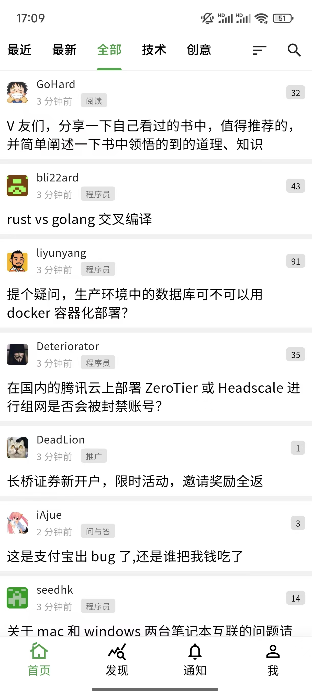
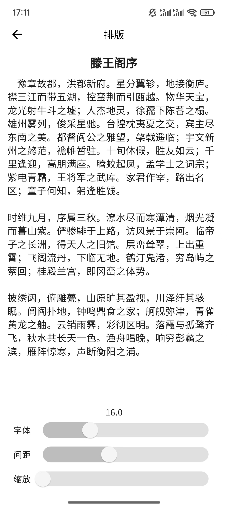
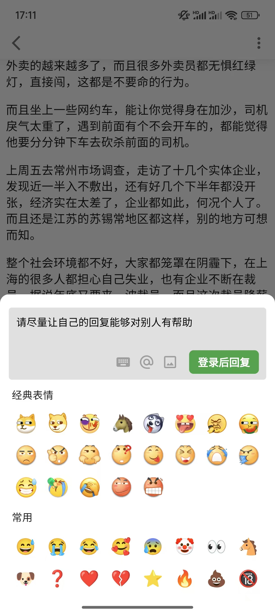
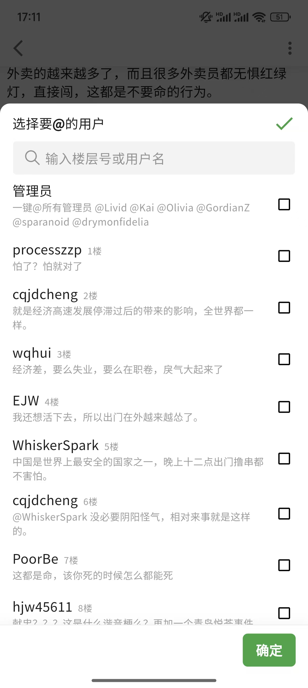

## V2Next - 一个好用的 V2EX 辅助 App

支持楼中楼、回复上下文、高赞回复、卡片模式、发送图片和表情 emoji、base64 解码等等功能

## 下载

- [Android Apk](https://github.com/zyronon/V2Next/releases)
- iOS App 请自行打包

### 功能列表

- 楼中楼：主题下的评论回复支持层级展示，可以更轻松地跟踪和回复其他用户的评论
- 高赞回复：自动筛选出感谢最多的回复，第一时间追上热评
- 自由排版：可自行对字体、间距、缩放进行设置，以满足每个人的需求
- 用户标签：对用户设置标签以进行标记
- 首页Tab编辑：可自由编辑，将自己关注的节点放在首页
- 最新、历史最热：可查看最新发布的帖子和往天的最热帖子
- 表情回复支持：评论输入框可以选择 Emoji 和贴吧表情，让回复更加生动和有趣
- 便捷图片上传：粘贴、拖放极速上传图片
- 划词 base64 解码：选中需要解码的文字，即可自动解码
- 卡片模式：无需进入主题，在列表中即可浏览主题内容
- 链接自动转图片：回复中 imgur 链接会自动转换成图片
- 替换Imgur源：回复中 imgur 链接可选择换源
- 一键@所有人，@管理员：回复时，可一键@所有人和@管理员
- 查看回复上下文：一键查看相关联的所有回复

## 截图
  

    </img>
    </img>
    </img>
    </img>
    </img>
    </img>

 

## 常见问题

y
  
为什么要加载所有回复？

如果有多页回复，只解析当前页的话，那么许多楼层会找不到@的人，因为有可能@的人在前一页

  
为什么有的「楼中楼」回复的楼层不正确？

由于 V2EX 的原回复并没有记录回复的楼层，本脚本只能根据被回复的用户去寻找此用户的最近一条回复，然后嵌入到这后面去，这种方法并不能保证正确识别用户真正要回复的是哪一个楼层。

  
为什么有的「楼中楼」回复指定了楼层还是不正确？

- 屏蔽用户导致楼层塌陷：你屏蔽了 A，自 A 以后的回复的楼层号都会减 1
   
- 忽略回复导致楼层塌陷：原理同上
   
- 回复时指定错了楼层号
   
- 脚本解析错误，请在[这里](https://github.com/zyronon/V2Next)反馈给我

  
详情页加载很慢？

回复多时会加载很慢，其实不是脚本的问题。是因为请求V站的其他页的回复时，V站迟迟未返回，导致我无法进行后续的解析，所以只能显示加载中...

 
## 如何帮助我

这个项目花了我很多精力，如果对您有用：

- 点个 Star ⭐️ 或分享给他人，让更多的人知道我的存在。
- 提供反馈，帮助我改进，以持续完善App。在[这里](https://github.com/zyronon/V2Next)提出。

## 更新日志：[https://github.com/zyronon/V2Next/releases](https://github.com/zyronon/V2Next/releases)

## 感谢
[VVEX](https://github.com/guozhigq/flutter_v2ex): 很多思路借鉴了 VVEX， 感谢 🙏
